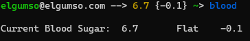

# Fishblood
## Nightscout Blood Glucose values in your Fish terminal prompt

Having recently been diagnosed with Type 1 Diabetes, I wanted a way to see my Blood Glucose and Delta values at a glance when working from my terminal, and a quick way to to configure this for all the terminals and systems I work with. Fishblood is the quick hacky way I accomplished this.



Fishblood will install a crontab entry for the current user to pull the bloodsugar values every minute and update `/tmp/blood` (default configuation). After modifying the prompt file the values will be displayed on the Fish terminal prompt, as shown in the screenshot above.

### Dependencies
This is tested as working on Ubuntu with `Fish 3.3.1`, and requires the tools `jq` and `curl`, as well as a working `Nightscout` instance, or any server endpoint where the Blood Glucose and Delta values are updated and can be pulled from. 

<i>Note: Uncomment the lines in the installation script to install the latest version of Fish if necessary.</i> 

 - <a href="https://nightscout.github.io/">Nightscout</a>
 - <a href="https://fishshell.com/">Fish shell</a>

### Usage

#### Configuration:
```console
  git clone https://github.com/elgumso/fishblood
  cd fishblood
```
Edit the install script with your favourite text editor and change the `NS_URL` value to point at your Nightscout instance.

#### Installation:
```console
  chmod +x fishblood_install.sh
  ./fishblood_install.sh
```
The installation script will backup the `prompt_login.fish` file to the users home directory. If anything goes wrong, just restore this file over the original prompt file in `/usr/share/fish/functions/`

#### WSL:
When running WSL the `cron` service is not started by default. The service can be started manually on Ubuntu using the following command: 
```console
  sudo service cron start
```
<i>Note: this only needs to be done in the first instance of starting WSL.</i>

Alternatively Windows Task Scheduler can be used to automatically start cron if you're into that sort of thing - <a href="https://www.howtogeek.com/746532/how-to-launch-cron-automatically-in-wsl-on-windows-10-and-11/">How to Launch Cron Automatically in WSL on Windows 10 and 11</a>